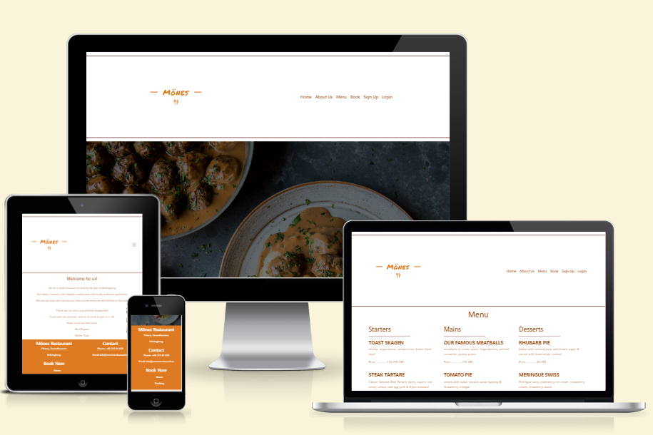
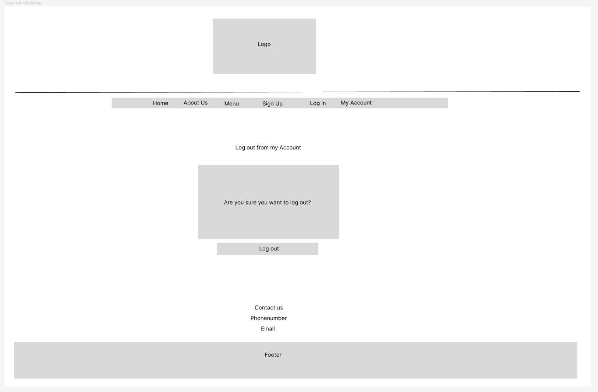

# Mönes Restaurant

Mönes restaurant is my fourth project and is a simple restaurant booking system. 
This will use languages such as HTML, CSS, JavaScript Python and Django.

This project will show the use of CRUD functionality (Create, Read, Update, Delete). The user will be able create, read, update and delete bookings.

The live website can be found [here](https://mones-restaurant.herokuapp.com/).

## User Experience (UX)

A visitor to Mönes Restaurant probably is interested in food and to eat at restaurants. 
The user wants to know what kind of food the restaurant serves and the possibilities to book a visit.

This website provides an easy way to book a table at a restaurant.

##  Strategy Plan

### Project Goals

The main goal of this project is to allow the user to sign up, log in/out, and create/read/update/delete a table booking in a simple and effective process.
### User Goals

- As a visitor I want to be able to view the menu so that I can deside if I want to book a table.
- As a visitor I want to book a table for a specific date and time.
- As a visitor I want to book a table for a specific number of people.
- As a visitor I want to edit a booking if I need to do any changes.
- As a visitor I want to delete a booking that I already made.

### User Expectations

- The website should be easy to navigate.
- The website is responsive on all devices.
- The menu is clear to read

### User Stories

The agile methodology were used throughout the project. I used the GitHub projects board to log all user stories as my project management tool. Creating epics and user storys for this project helped me to focus on the necessary tasks and a working environment the goals where easy to visualize.

### Scope

#### EPIC: Navigation & Information
Create templates, navigation and responsive design for the site.

##### User Stories

- As a site User I can intuitively navigate through the site so that I can easily find the desired information.
- As a site User I can understand the site's purpose immediately so that I can decide if it meets my needs.
- As a site User I can expect responsive design so that I can view the site on multiple devices.

#### EPIC: Admin Account

Create an admin account with CRUD functionalities.

##### User Stories

- As a site Admin I can use an admin panel so that I can manage bookings.
- As a site Admin I can use an admin panel so that I can receive/ answer messages from the contact form.

#### EPIC: User Account

Allow Users to create/update/manage and delete user accounts.

##### User Stories

- As a site User I can create an account so that I can make, change or delete a booking.
- As a site User I can log in/out and manage my account so that I can manage or delete my profile.

#### EPIC: Booking

Create a booking system so the user can make a booking for a table by choosing date, time and number of people.

##### User Stories

- As a logged in site User or Admin I can select a date, time and number of people so that I can book a table.
- As a logged in site User/ Admin I can manage a booking** so that I can change or cancel my booking as needed.

#### EPIC: Contact Form

Create a contact form so the site User can send message to the Admin

##### User Stories

- As a site User I can submit a contact form so that I can ask for additional information.

#### EPIC: Error Pages

Create status error pages so users will now if there is a problem.

##### User Stories

- As a site User I can see custom error pages so that I will know if there is a problem.

## Structure

### Database Model

I used principles of Object-Oriented Programming throughout this project and Django’s Class-Based Generic Views. Django AllAuth was used for user authentication.

A custom booking model was made to implement CRUD functionality. This alloed loged in user to to add, read, edit or delete a booking. This can be done both from the live website and from the admin panel.
The function in the booking model also looking for available tables on the date and time the user requests, and by the number of guests the booking is for.

The table model represents the table in the restaurant with the number of available seats.

Database model:

## Skeleton

### Wireframes

#### Landing Page

#### About Us 

#### Menu 

#### Login 

#### Logout 

#### My Account

#### Sign Up 

## Surface

## Features

### Design

### Color Scheme

I used the color #de7a22 from the logo to generate the colors.

The color palette for the website was generated from [My Color](https://github.com/moolleer/P4-m-nes-restaurant/blob/main/docs/testing.md)

### Existing Features

A customized logo was created using the free logo generator,[Hatchful](https://github.com/moolleer/P4-m-nes-restaurant/blob/main/docs/testing.md), by Shopify.

### Future Features

## Testing

All testing information can be found here [testing.md](https://github.com/moolleer/P4-m-nes-restaurant/blob/main/docs/testing.md)

## Deployment

The following steps were taken to deploy the live website to Heroku from the GitHub repository:
Before final deployment to Heroku:
 - Set debug = False in settings.py file.
 - Commit and push all files to GitHub

The site was deployed using Heroku. The steps to deploy are as follows: 
1. Go to [Heroku](https://dashboard.heroku.com/apps)
2. Go to 'New' and select 'Create a new app'
3. Input your app name and create app.
4. Navigate to 'Settings'
5. On the Config Vars section, enter the following values:
    - SECRET_KEY: The Secret Key for your project
    - DATABASE_URL: The URL from your ElephantSQL dashboard
    - CLOUNDINARY_URL: The URL from your Cloudinary dashboard
    - PORT: 8000
6. Navigate to the 'Deploy' section. 
7. Connect to GitHub, search for your repo and confirm. 
8. Choose branch to deploy.
9. Your app should now be available to see. You can choose whether to have your app automatically redeploy with every push or to keep it manual. 

## Credits & Content

- Navbar effect [Codepen](https://codepen.io/maheshambure21/pen/QwXaRw)
- Model ID [DjangoAndy](https://djangoandy.com/2020/10/14/should-i-use-uuid-as-my-model-id-in-django/)
- How to filter in Django [StackOverflow](https://stackoverflow.com/questions/10040143/and-dont-work-with-filter-in-django)
- For a restaurant booking [Youtube](https://www.youtube.com/watch?v=yenjz1Wv9Yo&t=900s)and [Github](https://github.com/daisygunn/grow-restaurant)
- For booking a table [Youtube](https://www.youtube.com/watch?v=m7uVhLxT1AA&t=23s) and [Youtube](https://www.youtube.com/watch?v=-9dhCQ7FdD0&t=32s)
- Login requirements [Full Stack Python](https://www.fullstackpython.com/django-contrib-auth-decorators-login-required-examples.html).

### Media

- The hero image are from [Freepik](https://www.freepik.com).

## Project Acknowledgements
- Code Institue Tutor Support - For directing me to the correct solutions for any bugs.
- My Mentor - For his big support.