## Testing

### Lighthouse

I have checked the accessibility of the site using lighthouse.

### W3C Validator Tools

#### HTML

I used [W3C Markup](https://validator.w3.org) to check for any errors within the HTML pages.

I had a stray end tag.

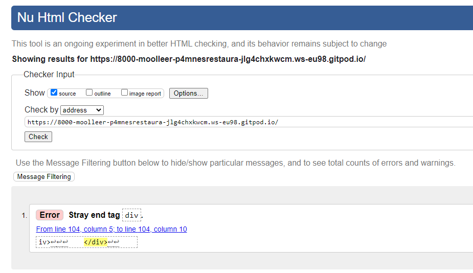

After I removed it no error was found.

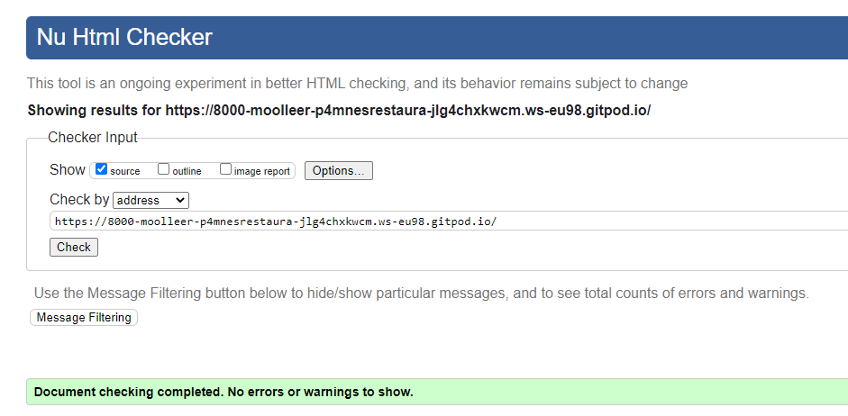

#### CSS

For CSS I used [W3C CSS Validation](https://jigsaw.w3.org/css-validator/) 

No errors were detected.

[W3C CSS Validation](readme_images/css-validator.png)

#### JavaScript

I used  [JS Hint](https://jshint.com/) to check for errors within my JavaScript script tags.
I only had one function used from Code institute Walktrough Project, and I have not made any changes to the code.

[JS Hint](readme_images/jsHint.png) 

#### Python

To check for errors in my Python files I used [CI Python Linter](https://pep8ci.herokuapp.com/)

No issues or errors were found. Please see the results for each page below.

#### mones

  
urls.py - No errors
 
  
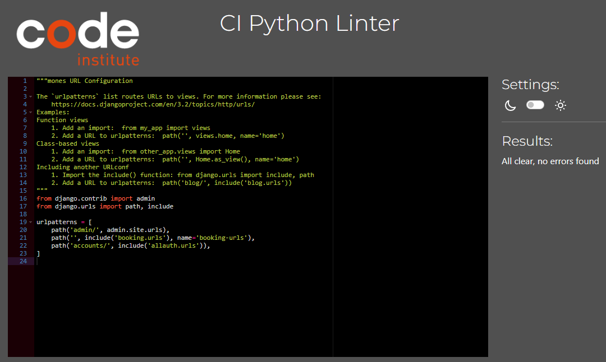

  
settings.py - Line to long errors that cannot be shortened
 
  
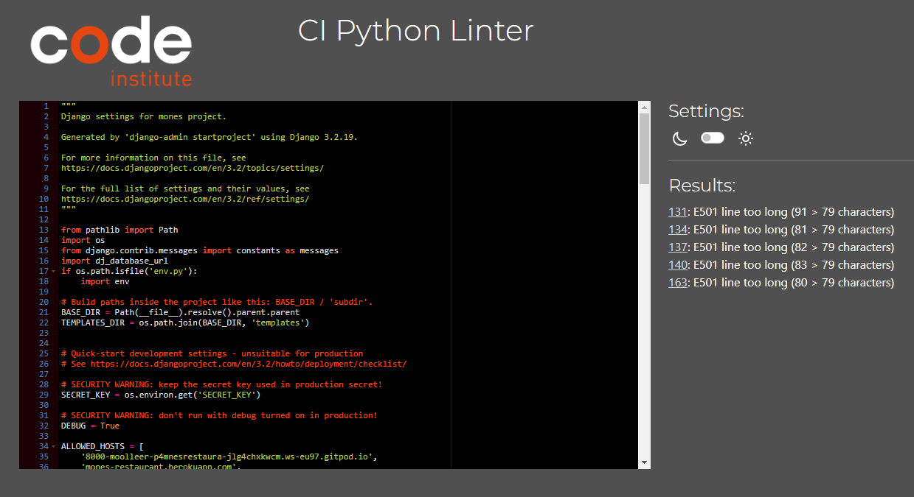

#### booking App

  
admin.py - No errors
 
  
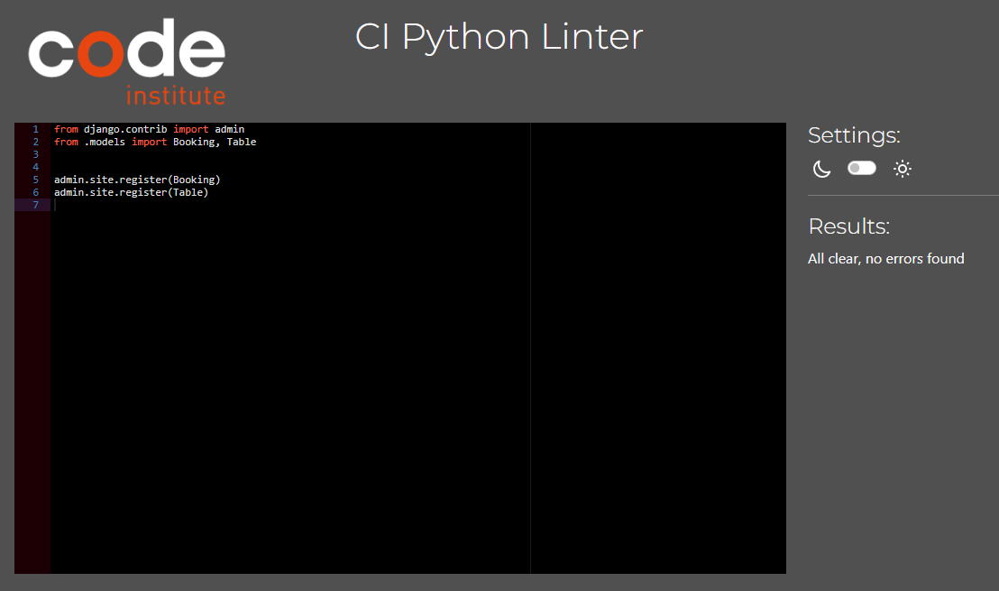

  
forms.py - No errors
 
  
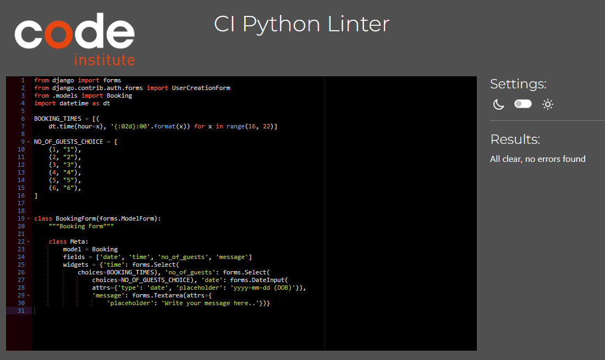

  
models.py - No errors
 
  
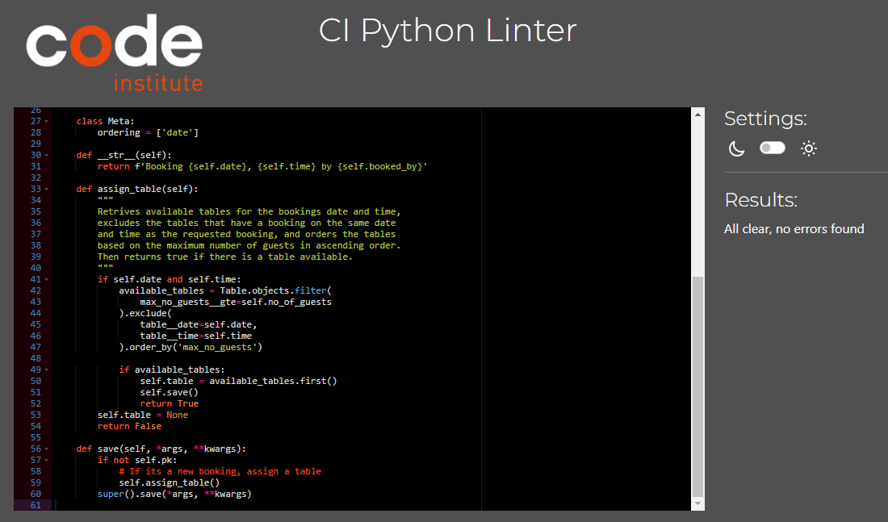

  
urls.py - Line to long errors that cannot be shortened
 
  
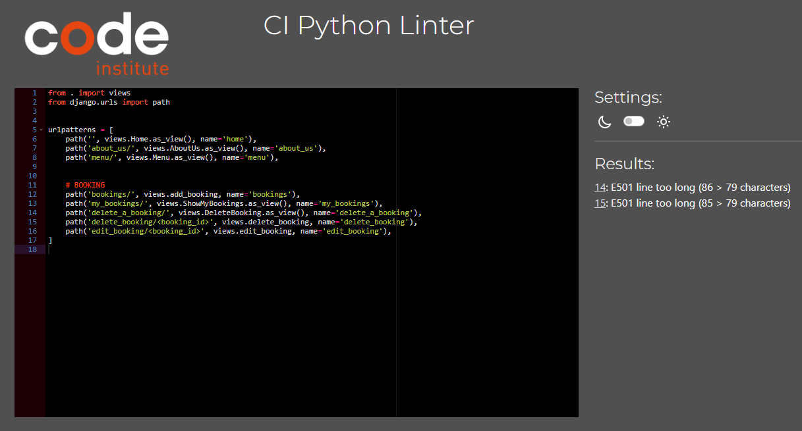

  
views.py - No errors
 
  
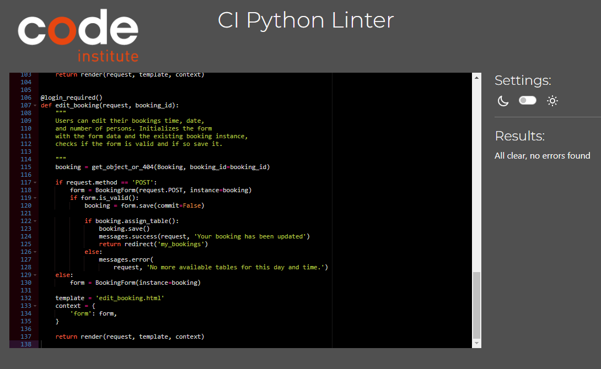

## Accessibility

Usually Lighthouse is used for accessibility testing, but at the time of testing Lighthouse didnt work.
Therefore I have used [Wave Web Accessibility Evaluation Tools](https://wave.webaim.org/) instead.

  
Home Page - No errors

  The contrast errors will be changed to a larger text, and different color in future development for increased accessibility.

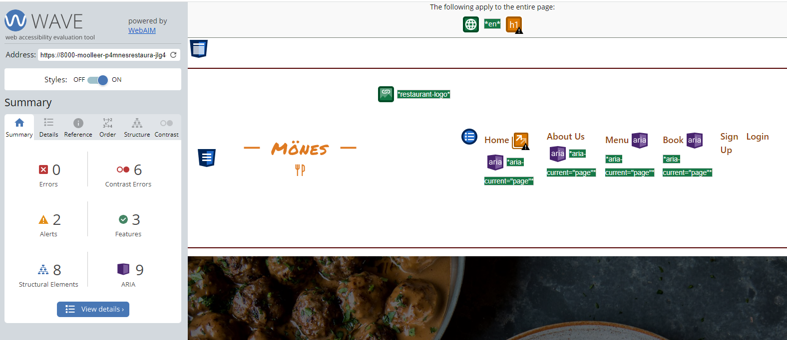

  
About us - No errors

  The contrast errors will be changed to a larger text, and different color in future development for increased accessibility.

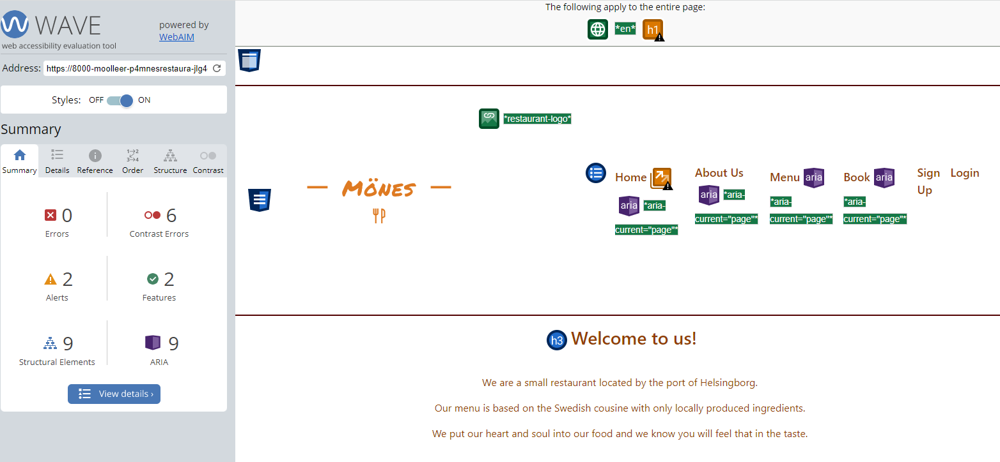

  
Menu - No errors

  The contrast errors will be changed to a larger text, and different color in future development for increased accessibility.
  
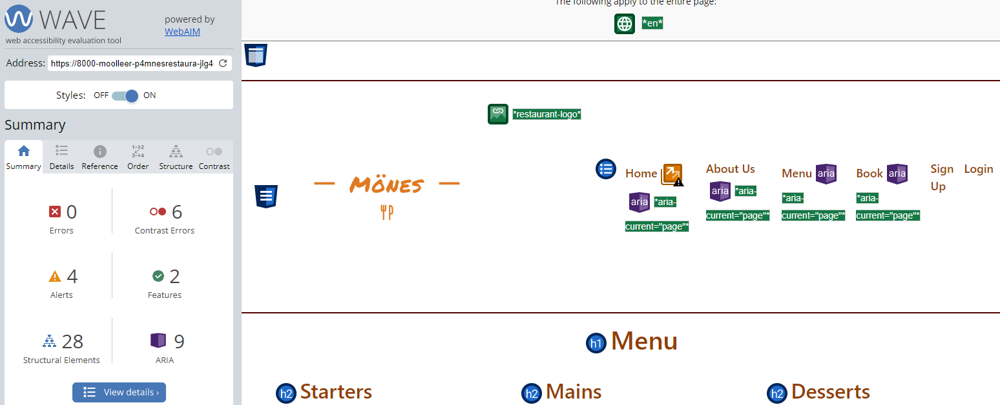

  
Login - No errors

  The contrast errors will be changed to a larger text, and different color in future development for increased accessibility.
  
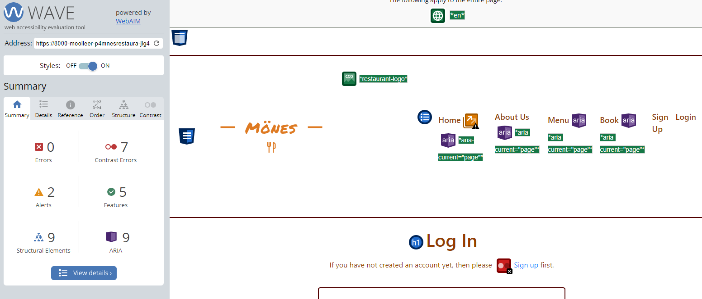

  
Sign up - No errors

  The contrast errors will be changed to a larger text, and different color in future development for increased accessibility.
  
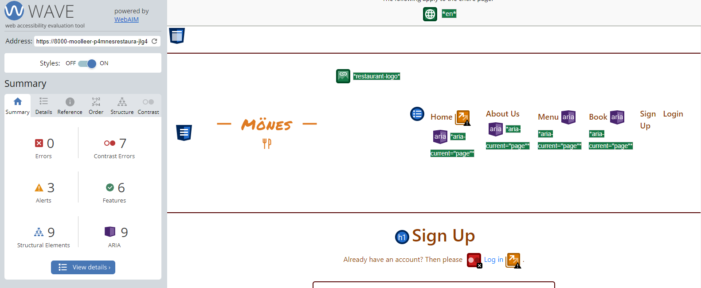

## Browser Testing

The website was tested on Microsoft Edge, Google Chrome, Firefox and Safari browsers. No issues detected.

## Device Testing

To ensure the responsiveness the website was tested on multiple devices with different screen sizes, such as Ipad, Iphone, Android devices, bigger computer screens and labtops.

## Manual Testing

### Navigation Bar
All pages

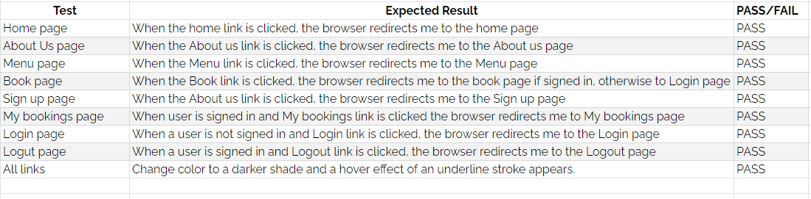

### Footer

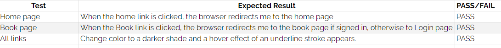

### Sign Up

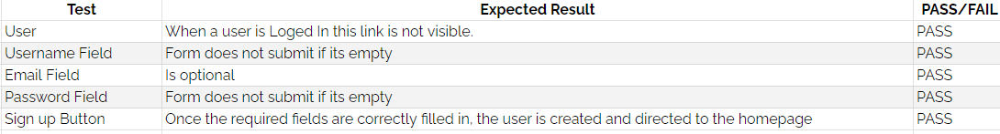

### Log In Page

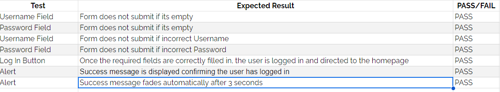

### Log Out Page

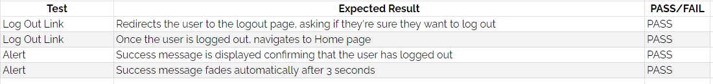

### Booking

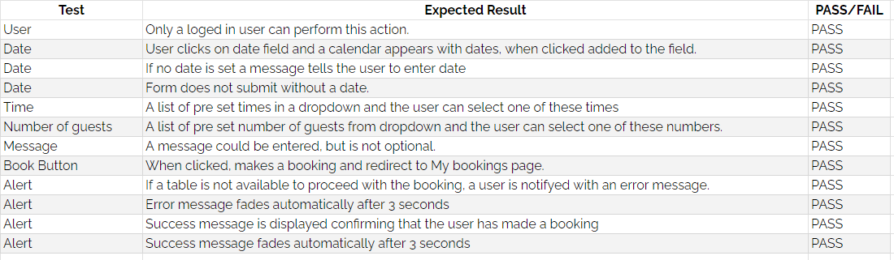

### Edit Booking

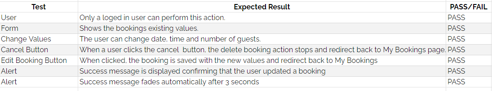

### Delete Booking

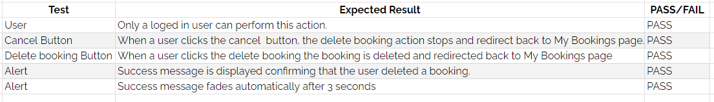

## Bugs

